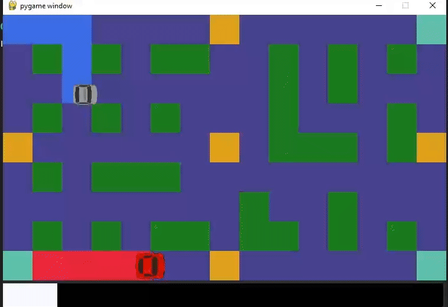

# Paint Chase Recreated in Python

## Description
Fan-made python project for the ["Programming with Python"](https://github.com/fmipython) course at Sofia University "St. Kliment Ohridski", Faculty of Mathematics and Informatics.

Made entirely based on the [UFO 50 game](https://50games.fun/).



## Instructions on running the game

1. Download the source code/clone the repository
2. Navigate to the project's directory
3. Create a virtual environment using py -m venv .venv and activate it (Optional)
4. Install the dependencies:
```
pip install -r requirements.txt
```
5. To start the game run the following file:
```
python main.py
```

## Playing the game
* Players use the arrow keys (and WASD if multiplayer) to move.
* The goal is to cover more of the board in your paint color when the time runs out!
* Go over boost pads to gain a temporary speed boost!
* Crash into your opponents to destroy them! 
